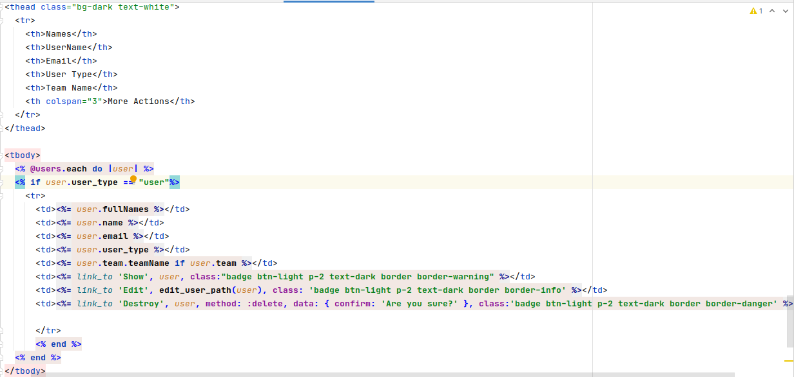
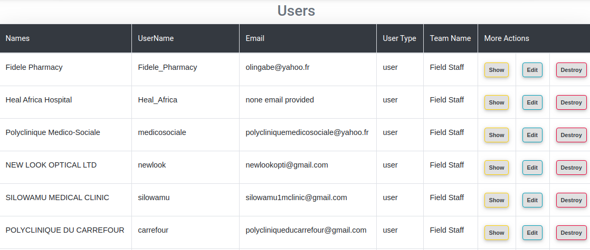

## Introduction to rails

 + What is Rails   
 
   Rails is used to deal with Ruby on Rails(RoR). It is a server-side web application framework that uses model–view–controller (MVC) for defining the          communication between databases and user interface of the web application
 + Difference between rails and other programming languages   
 
    Ruby on Rails is an open source framework that runs on ruby progamming language. Ruby an object-oriented language and is faster as the codes runs without     an other execution like converting into machine language. You can access many Rubygems and libraries in your applications
   
## CHAPTER 3. RAILS APPLICATIONS AND EXAMPLES
   
 + Creating new rails application  
   To created a new rails application use the command **rails new appname -d db** For example **rails new WorkSampleApp -d postgresql**  
   this will create application called WorkSampleApp and it will use postgresql database
   **N.B:** using the above command without specifing the database to use, it will use the default and most of the time is sqlite
 + Dealing with postgresql database  
   To access rails postgresql database simply use the command **rails db**. This will take you to the database management terminal where you can view, and update data from the database
 + Rails modeling  
   A Rails Model is a Ruby class that can add database records (think of whole rows in an Excel table), find particular data you're looking for, update        data, or remove data. These common operations are referred to by the acronym CRUD--Create, Remove, Update, Destroy.  
   To generate model in rails use the command `rails generate model ModelName ColumnOneName:ColumnOneType ColumnTwoName:ColumnTwoType`  
   For example `rails generate model User username:string password:string`  this command will create app/models/user.rb and              db/migrate/20130518173035_create_users.rb files. Model can be used for validations and other user data saving acts.  
 + Rails migrations  
 The migration file, which is stored in db/migrate like all other migrations files. Migrations describe the changes we'll be making to our database (though   haven't actually enacted just yet). In this case, the generated migrations file say:  
  class CreateUsers < ActiveRecord::Migration  
  
   > def change  
   
   >> create_table :users do |t|  
   >>> t.string :username  
   >>> t.string :password  
   >>> t.timestamps  
   
   >> end  
   
   > end  
  end  
  
    To run rails migration activities use the command `rake db:migrate` or `rails db:migrate`.  
 + Rails controllers  
 The Rails controller is the logical center of your application. It coordinates the interaction between the user, the views, and the model.  
 Rails controller contains a number of actions that controls the user interaction with the application. Let's have an example  
 
 Class UsersController < ApplicationController  
 
  > def list  
   end
   
  > def show  
   end
   
   > def new  
   end
   
   > def create  
   end
   
   > def edit  
   end
   
   > def update  
   end
   
   > def delete  
   end

end

This controller shows list, show, new, create, edit, update and delete activities written in the form of methods  
You can define your action in the way you want, like if you want to display all users you can user action list as follows:  

  def list  
  
  > @users = User.all  
  
  end  
  
 + Rails routes
 The Rails router recognizes URLs and dispatches them to a controller’s action. It can also generate paths and URLs, avoiding the need to hardcode strings in your views.
 
 Example:  
 
 Rails.application.routes.draw do  
 
   > get 'signup', to: 'users#new', as: 'signup'  
   resources :users  
   
 end 
 
 This gives us ability to access the signup page from new action of the users controller through the URL signup/.  You can also define URLs for all controller actions(ressourses) by putting `resources :users` in the 
 
 + Rails views
 A Rails View is an ERb program that shares data with controllers through mutually accessible variables.  
 It is used to display information to the user when browsing on application. Here is an example:  
 
   
 
 This produces the following output  
 
  
 
 + Scaffolding  
 
 “Scaffolding is a temporary structure used to support a work crew to aid in the construction, maintenance and repair of buildings, bridges and all other    man-made structures.” – Wikipedia  
 
 In Rails, a scaffold is a set of automatically generated files which forms the basic structure of a Rails project.  
 If you want to create the models, views, and controllers for a new resource in a single operation, scaffolding is the tool for the job.
 To generate rails scaffold use `rails g scaffold name` where name is the name of the scaffold.  
 Example: `rails g scaffold users email:string password_digest:string`  
 The above command generates the scaffold with the fields email and password_digest of the type string
 

